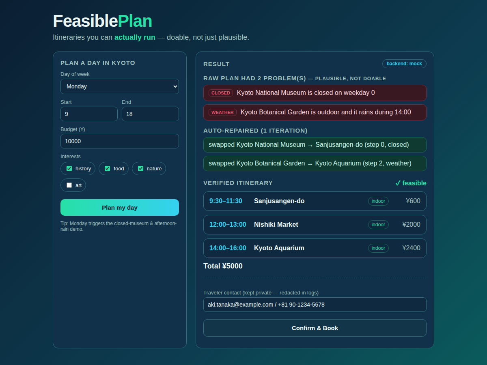

# FeasiblePlan — a travel concierge that returns itineraries you can *actually run*

> **Track:** Concierge Agents · **Author:** cncgl (concigel@gmail.com)
> **Repo:** https://github.com/cncgl/kaggle-vibecoding-agents-capstone-project · **Video:** (paste YouTube link)
> **Cover image:** `docs/cover.svg` (export to PNG)

## The problem: plausible ≠ doable

Ask almost any AI travel planner for "a day in Kyoto" and you get a *plausible* itinerary:
a famous museum in the morning, a garden in the afternoon, a nice dinner. It reads
beautifully — and then it falls apart in the real world. The museum is **closed on
Mondays**. The garden is **outdoor and it's raining at 3pm**. The two stops are **40
minutes apart with 5 minutes between them**. The plan is **¥4,000 over budget**.

These aren't edge cases; they are the *default* failure mode of a language model that
optimizes for a confident-sounding answer over a runnable one. A concierge whose plans
break on contact with reality is worse than no concierge at all.

## The idea: confine creativity, verify everything

**FeasiblePlan** is built around one conviction: an itinerary is only worth giving to a
user if it is **doable**, not merely plausible. We get there by splitting the work
between two very different kinds of agent:

- A **Planner** (an LLM) does the *creative* work — proposing an interesting day.
- A **Verifier** (deterministic code) is the *source of truth* — it checks every step
  against real-world constraints and never hallucinates.
- An **Orchestrator** runs a **plan → verify → repair loop**: the Verifier's violations
  are fed back to the Planner, which repairs the plan, until it is feasible.

The Planner is deliberately *not* told the weather forecast, so — like a real LLM — it
can genuinely propose an outdoor stop that turns out to clash with afternoon rain.
That mistake is the point: it's exactly what the Verifier exists to catch and the repair
loop exists to fix. The trust comes from the deterministic Verifier, not from hoping the
LLM got it right.

```
[Orchestrator]  (root agent — owns the control flow)
  ├─ Profiler / Memory   load long-term preferences
  ├─ Planner (LLM)       draft an itinerary   ← creativity lives ONLY here
  ├─ Tools               weather · places · travel time
  └─ Verifier (code)     check open-days/hours, weather, travel, budget, day-window
        ↑↓  repair loop: violations → Planner → re-verify  (≤3 iterations)
  → a verified itinerary + a "feasibility report"
```

## What it does, concretely

Running the sample (Kyoto, Monday) shows the whole story end to end:

1. The Planner drafts a day. The Verifier finds violations, e.g.
   *"Kyoto National Museum is closed on weekday 0"* and
   *"Maruyama Park is outdoor and it rains during 14:00."*
2. The Orchestrator feeds those violations back; the Planner swaps the closed museum
   for an open indoor one and the rainy-afternoon park for an aquarium.
3. The result is a **feasible** itinerary plus a human-readable **feasibility report**
   (initial violations → repairs → final plan) — the artifact that makes the value
   visible.

## Does it actually work? An evaluation, not a vibe

The differentiator is a claim — "we return doable plans" — so we **measure** it. The
eval harness (`eval.py`) runs five scenarios (varying weekday, weather and budget) and
compares two numbers:

- **BEFORE** — feasibility of the Planner's *raw* draft (what an ordinary travel-AI hands you).
- **AFTER** — feasibility once FeasiblePlan's verify→repair loop has run.

| | Feasible plans |
| --- | --- |
| **BEFORE** (raw planner) | **40%** (2/5) |
| **AFTER** (FeasiblePlan) | **100%** (5/5) |
| **Lift from verify→repair** | **+60 points** |

The same +60-point lift reproduces across backends (Gemini 2.5 Flash *and* a local
Qwen3 27B), which is the honest result: a capable LLM still ships infeasible plans 60%
of the time on hard days, and the self-verification loop is what closes the gap.

## The course concepts it demonstrates (≥3)

**1. Multi-agent orchestration with Google ADK.** The Planner is a real ADK `LlmAgent`
with structured output; the Orchestrator, Verifier and Profiler are distinct roles with
a clean contract between them (`roles/`). Creativity and verification are *different
agents* on purpose.

**2. Tool use.** The agents consult tools for ground truth — a weather tool (demo
forecast plus a live, key-free open-meteo fetch), a curated places dataset, and a
travel-time estimator (`tools/`). The Verifier's checks are only as trustworthy as these
tools, so they're kept deterministic and inspectable.

**3. Sessions & Memory.** User preferences (pace, budget, interests, party, mobility)
persist across runs as long-term memory (`memory.py`, `roles/profiler.py`), so the
concierge can be personalized rather than starting cold every time.

**4. Security & human-in-the-loop — a Concierge requirement.** A concierge handles
personal data and can take irreversible actions, so we guard both: `security.redact`
masks PII (email, phone, precise coordinates) before *anything* is written to a log or
trace, and **booking is gated behind explicit human approval** (`orchestrator.book`) —
the agent presents a summary and only proceeds on a human "yes." It never books on its
own.

**5. Evaluation.** The feasibility metric above (`eval.py`) turns the value proposition
into a number that judges (and users) can check.

A sixth, emergent property: **no vendor lock-in.** The Planner runs on Gemini, *or* a
fully-local LLM (Ollama / LM Studio via ADK's `LiteLlm`), *or* a deterministic offline
mock — auto-selected, and any LLM failure (no key, rate-limit, malformed JSON) falls
back safely so the demo never crashes. The whole system can run **completely offline**.

## Design decisions worth calling out

- **The Verifier is deterministic on purpose.** Feasibility is a safety property; we
  don't want it decided by an LLM that might be confidently wrong. The LLM's creativity
  is confined to the Planner, where mistakes are cheap and caught.
- **Graceful degradation everywhere.** Every LLM call is wrapped so that a failure
  becomes a mock fallback, not a crash. This is why the offline mock still produces a
  feasible plan when the cloud quota is exhausted.
- **Honest demo.** We withhold the weather from the Planner so the failure→repair story
  is real, not staged.

## A demo you can use — and deploy

The same agent runs behind a one-page web UI (FastAPI, no build step): pick a day, hit
**Plan my day**, and watch the raw plan's problems (red), the auto-repairs (green), the
verified itinerary, and a **Confirm & Book** human-in-the-loop button — all on one
screen.



Because the HTML and the API ship in **one container** (`Dockerfile`), it deploys as-is —
`docker run -p 8000:8000 feasibleplan`, or `gcloud run deploy feasibleplan --source .`
(Cloud Run) — which is the **Deployability** concept, demonstrable live.

## How to run it (public repo + setup)

No deployment required — the repository is public and runs in a few lines:

```bash
uv sync
uv run python -m kaggle_vibecoding_agents_capstone_project.agent   # CLI: plan → verify → repair + booking gate
uv run python -m kaggle_vibecoding_agents_capstone_project.eval    # BEFORE→AFTER feasibility
uv run python -m kaggle_vibecoding_agents_capstone_project.web     # web UI at http://localhost:8000
```

It runs **offline with zero configuration** (deterministic mock). To use a real LLM, add
a `.env` (see `.env.example`):

- **Cloud:** a free Gemini key from Google AI Studio (`GOOGLE_API_KEY`).
- **Local:** point at Ollama or LM Studio (`FEASIBLEPLAN_BACKEND=local`, a base URL and a
  model you've loaded) — no key, no quota, fully offline.

## Limitations & what's next

FeasiblePlan is an honest MVP. The places dataset is a curated Kyoto set (next: back it
with the **Maps MCP** server for any city), the weather is a demo forecast with a live
fetch ready to wire in, and the Profiler stores preferences but doesn't yet *learn* from
post-trip feedback. Observability hook-points are marked in the Orchestrator for
OpenTelemetry, and a thin web UI on Cloud Run / Agent Engine is a natural next step.
None of these change the core contribution: **a concierge that proves its plans are
runnable before handing them to you.**

---

_Built for the 5-Day AI Agents Intensive Vibe Coding Capstone with Google._
